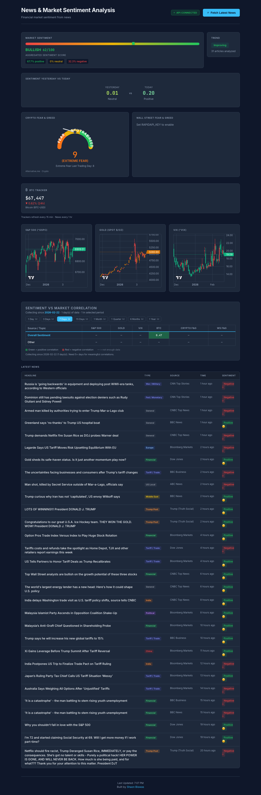

# Breaking News & Market Sentiment Analysis

A full-stack financial sentiment dashboard that aggregates breaking news, analyzes market sentiment with NLP, and visualizes live market data — S&P 500, Gold, VIX, and Bitcoin.

[](https://www.python.org/)
[](https://reactjs.org/)
[](https://flask.palletsprojects.com/)

---

## Screenshots

| Dashboard |
|-----------|
|  |

---

## Features

- **News aggregation** — RSS feeds from Bloomberg, CNBC, Reuters, Yahoo Finance, Dow Jones (no API key required)
- **Sentiment analysis** — VADER-based NLP with positive/negative/neutral classification
- **Market charts** — Interactive candlestick charts for S&P 500, Gold, and VIX (90-day history)
- **Fear & Greed Index** — Crypto market sentiment gauge (Alternative.me)
- **BTC tracker** — Real-time Bitcoin price and 24h change
- **Trend detection** — Improving, declining, or stable sentiment over time
- **Optional NewsAPI** — Add more sources with a free API key

---

## Tech Stack

| Layer | Stack |
|-------|-------|
| Backend | Python | Flask | pandas | yfinance | VADER |
| Frontend | React 18 | Vite | lightweight-charts |
| Data | RSS feeds | Yahoo Finance | Alternative.me |

---

## Quick Start

```bash
# Clone
git clone https://github.com/ShaonINT/breaking_news_market_sentiment.git
cd breaking_news_market_sentiment

# Backend
python -m venv venv
source venv/bin/activate  # Windows: venv\Scripts\activate
pip install -r requirements.txt

# Frontend
cd frontend && npm install && cd ..

# Run
./start.sh
```

Open **http://localhost:3000**. Click **Fetch Latest News** to load and analyze articles.

### Manual (two terminals)

```bash
# Terminal 1 — Flask API
python api/app.py

# Terminal 2 — React dev server
cd frontend && npm run dev
```

### Production build (single server)

```bash
cd frontend && npm run build && cd ..
python api/app.py
```

Open **http://localhost:5001**.

---

## Deployment

### Render (recommended)

1. Push to GitHub
2. [Render Dashboard](https://dashboard.render.com) → **New** → **Blueprint**
3. Connect your repo — Render detects `render.yaml`
4. Select **Free** instance → **Apply**

Your app: `https://<your-service>.onrender.com`

### Other options

See **[DEPLOYMENT.md](DEPLOYMENT.md)** for Koyeb, Railway, Docker, and VPS.

---

## API

| Endpoint | Method | Description |
|----------|--------|-------------|
| `/api/health` | GET | Health check |
| `/api/news` | GET | Latest news archive |
| `/api/sentiment-summary` | GET | Current sentiment |
| `/api/sentiment-history` | GET | Historical sentiment |
| `/api/fear-greed` | GET | Fear & Greed Index |
| `/api/markets` | GET | S&P 500, Gold, VIX, BTC OHLC |
| `/api/pipeline/run` | POST | Trigger news fetch & analysis |

---

## Configuration

| Variable | Description |
|----------|-------------|
| `PORT` | Server port (default: 5001) |
| `NEWSAPI_KEY` | Optional — [newsapi.org](https://newsapi.org) for extra sources |

```bash
cp .env.example .env
# Add NEWSAPI_KEY=your_key_here
```

---

## Project Structure

```
├── api/app.py           # Flask REST API
├── frontend/            # React (Vite) dashboard
│   ├── src/
│   │   ├── App.jsx
│   │   ├── Sp500Chart.jsx
│   │   ├── GoldChart.jsx
│   │   └── VixChart.jsx
│   └── package.json
├── src/
│   ├── news_extractor.py
│   ├── sentiment_analyzer.py
│   ├── sentiment_tracker.py
│   ├── market_data.py
│   └── fear_greed.py
├── main.py              # CLI pipeline
├── render.yaml          # Render deployment
├── Dockerfile
└── DEPLOYMENT.md
```

---

## License

MIT

---

**Shaon Biswas** — [github.com/ShaonINT/breaking_news_market_sentiment](https://github.com/ShaonINT/breaking_news_market_sentiment)
